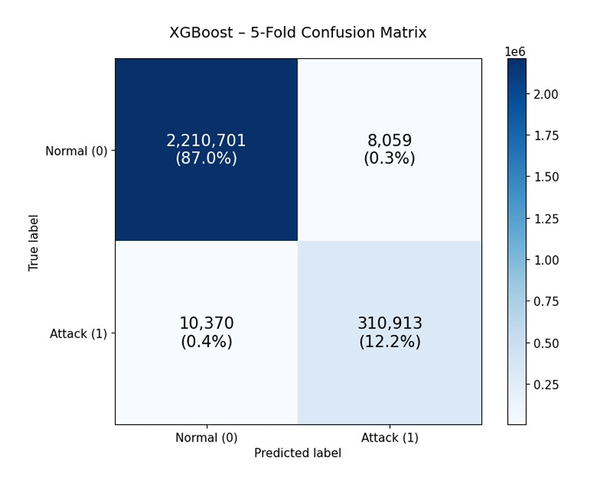
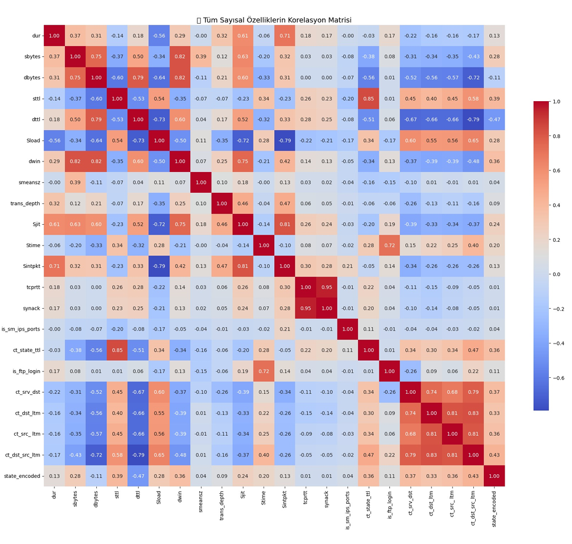

# 🛡️ Real-Time Cyber Attack Detection via ML/DL

[](https://ieeexplore.ieee.org/document/11208415)
[](https://www.python.org/)
[](LICENSE)

## 📋 Overview

A intrusion detection system (IDS) framework combining machine learning and deep learning models for real-time network attack detection, evaluated on the UNSW-NB15 dataset.

### 🎯 Key Highlights

- **Best ML Model:** XGBoost → **F1: 98.08%**, Recall: 97.87%, Precision: 98.30%
- **Best DL Model:** Focal Loss DNN → **F1: 96.80%**, Recall: 96.63%
- **Dataset:** UNSW-NB15 (2.5M records, 49 features, 87% normal / 13% attack)
- **Real-time Performance:** 0.60 µs/sample prediction time (XGBoost)

---

## 🏆 Published Research

**Title:** Real-Time Cyber Attack Detection via Machine Learning and Deep Learning Approaches  
**Author:** Miray Sude Mutlu  
**Conference:** ASYU 2025, IEEE International Conference  
**Location:** Bursa, Turkey | September 10-12, 2025  
**DOI:** [10.1109/ASYU67174.2025.11208415](https://ieeexplore.ieee.org/document/11208415)

---

## 📊 Performance Summary

### Machine Learning Models

| Model | Accuracy | Precision | Recall | F1 Score | Pred. Time (µs) |
|-------|----------|-----------|--------|----------|-----------------|
| **XGBoost** | **99.32%** | **98.30%** | **97.87%** | **98.08%** | **0.60** |
| Random Forest | 99.35% | 98.15% | 97.72% | 97.63% | 6.76 |
| CatBoost | 99.16% | 96.89% | 96.49% | 96.69% | 0.40 |
| Decision Tree | 99.40% | 97.83% | 97.43% | 97.58% | 0.14 |
| Logistic Regression | 98.30% | 93.21% | 93.38% | 93.29% | 50.0 |

### Deep Learning Models

| Model | Accuracy | Precision | Recall | F1 Score |
|-------|----------|-----------|--------|----------|
| **DNN + Focal Loss** | **99.19%** | **96.96%** | **96.63%** | **96.80%** |
| DNN + BatchNorm | 98.91% | 92.51% | 99.47% | 95.86% |
| DNN + Early Stop | 98.79% | 91.27% | 99.98% | 95.43% |
| DNN (Baseline) | 99.06% | 94.96% | 97.77% | 96.34% |
| Autoencoder (AE) | 94.73% | 72.92% | 92.84% | 81.68% |

---

## 🛠️ Tech Stack

**Machine Learning:**  


**Deep Learning:**  


**Data Science:**  


---

## 📂 Repository Structure

```
UNSW-NB15-IDS-Research/
├── docs/                 # Academic paper and technical documentation
├── visualizations/       # Performance charts and analytical plots
└── README.md             # Project overview
```

---

## 🔍 Methodology

### 1. **Data Preprocessing**
- Missing value imputation
- Categorical encoding (one-hot + label encoding)
- Log transformation for skewed features
- MinMax normalization [0,1]
- Class weighting for imbalance (87% normal / 13% attack)

### 2. **Feature Selection**
Systematic evaluation of 10 methods:
- Statistical: ANOVA F-test, Chi-square
- Information Theory: Mutual Information
- Embedded: Random Forest, XGBoost importance
- Wrapper: Recursive Feature Elimination (RFE)

**Top Features:** `sttl`, `ct_state_ttl`, `sbytes`, `dbytes`, `Sload`, `Dload`

### 3. **Model Training**
- **Stratified 5-Fold Cross-Validation**
- GridSearchCV hyperparameter optimization
- Class-weighted loss functions
- Early stopping & batch normalization

### 4. **Evaluation Metrics**
- Accuracy, Precision, Recall, F1-Score
- ROC-AUC curves
- Confusion matrices
- Training & inference time analysis

---

## 📸 Visualizations

### XGBoost Confusion Matrix (5-Fold CV)


### Correlation Heatmap


---

## 🗂️ Dataset Information

**UNSW-NB15 Dataset**  
- **Source:** Australian Centre for Cyber Security
- **Size:** 2,540,044 records
- **Features:** 49 attributes (network flow + packet-level)
- **Classes:** Binary (0 = Normal, 1 = Attack)
- **Imbalance Ratio:** 87% Normal / 13% Attack
- **Attack Types:** 9 categories (Fuzzers, Analysis, Backdoor, DoS, Exploits, Generic, Reconnaissance, Shellcode, Worms)

---

## 📄 Citation

If you use this work, please cite:

```bibtex
@inproceedings{mutlu2025realtime,
  title={Real-Time Cyber Attack Detection via Machine Learning and Deep Learning Approaches},
  author={Mutlu, Miray Sude},
  booktitle={2025 IEEE International Conference on Applied Sciences and University (ASYU)},
  pages={XX--XX},
  year={2025},
  organization={IEEE},
  doi={10.1109/ASYU67174.2025.11208415}
}
```

---

## 🔒 Code Availability

**Note:** Full source code is available upon reasonable request. This repository contains:
- ✅ Published IEEE paper (PDF)
- ✅ Methodology documentation
- ✅ Performance visualizations

## 🔒 Code Availability

Implementation details are not publicly shared in this repository.
For collaboration or further information, please contact the author.

For collaboration inquiries: [mutlumiraysude34@gmail.com](mailto:mutlumiraysude34@gmail.com)

---

## 🎓 Author

**Miray Sude Mutlu**  
📧 Email: mutlumiraysude34@gmail.com  
🔗 LinkedIn: [linkedin.com/in/miraysudemutlu](https://linkedin.com/in/miraysudemutlu)  
🐙 GitHub: [github.com/miriyayy](https://github.com/miriyayy)  
🎓 ORCID: [0009-0000-5974-0044](https://orcid.org/0009-0000-5974-0044)

**Affiliation:** Computer Engineering Department, Biruni University, Istanbul, Turkey

---

## 📜 License

This project is licensed under the MIT License - see the [LICENSE](LICENSE) file for details.

---

## 🙏 Acknowledgments

- Australian Centre for Cyber Security for the UNSW-NB15 dataset
- Biruni University Computer Engineering Department
- IEEE ASYU 2025 Conference Committee

---

⭐ **If you find this research useful, please consider citing the paper and starring this repository!**
